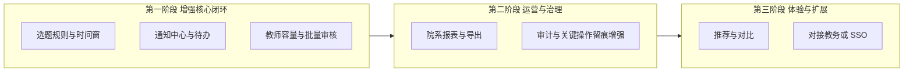

# ThesisConnect 产品功能扩展构想

## 现状锚点（基于仓库）

当前系统已具备：[ThesisConnect-Back/README.md](ThesisConnect-Back/README.md) 所述的用户/课题/选题/进度/文档、JWT 认证、统计、管理员系统配置与日志、文件上传；近期迭代还包含选题结果类邮件通知（`MailNotificationService`、选题相关模板）。以下构想均视为**在此基础上的增量**，避免与「双向选题」核心重复。

---

## 一、学生侧：降低摩擦、提高确定性

| 方向        | 功能点子                                  | 价值简述                |
| --------- | ------------------------------------- | ------------------- |
| **选题决策**  | 课题「收藏 / 对比」、简易问卷（兴趣方向、技术栈）后推荐课题       | 减少盲目投递，提高匹配度        |
| **流程透明**  | 选题时间轴视图：投递 → 待审 → 通过/驳回（含原因）→ 确认指导关系  | 与邮件通知形成闭环，减少焦虑与重复咨询 |
| **学业衔接**  | 开题/中期/答辩节点模板与截止提醒（站内消息 + 可选邮件 digest） | 把「进度」从字段升级为可执行计划    |
| **协作与交付** | 与指导相关的留言板或批注（按课题/阶段线程化），而非仅文件上传       | 降低沟通成本，留痕可查         |

---

## 二、教师侧：减负、可规模化指导

| 方向        | 功能点子                               | 价值简述        |
| --------- | ---------------------------------- | ----------- |
| **容量与质量** | 课题维度：计划招收人数、已确认人数、候补队列；批量审核与快捷回复语  | 避免超额指导，加速审核 |
| **筛选**    | 学生侧可见的「课题组要求」结构化字段（先修课、工具、每周可投入时间） | 提高师生匹配质量    |
| **指导过程**  | 周次例会纪要、阶段评语模板、对学生进度的「一键催办」（带礼貌模板）  | 把零散沟通产品化    |
| **风险预警**  | 长期未更新进度、临近节点未交文档的列表与导出             | 便于干预与向院系汇报  |

---

## 三、教务 / 管理员：规则、公平与报表

| 方向        | 功能点子                                 | 价值简述                      |
| --------- | ------------------------------------ | ------------------------- |
| **规则引擎**  | 可配置：选题开放窗口、每人可选志愿数、同一教师上限、跨专业是否允许    | 把线下规定固化到系统，减少争议           |
| **公平与审计** | 关键操作二次确认、导出审计包（谁在何时改了课题名额/审核结果）      | 与现有 `sys_log` 能力呼应，面向检查场景 |
| **院系视图**  | 按专业/班级/指导教师的选题饱和度、课题重复度、进度滞后率仪表盘     | 支撑资源配置与教学评估               |
| **数据出口**  | 标准字段导出（Excel/CSV）、与教务系统对接的「只读同步」设计占位 | 满足归档与对接需求                 |

---

## 四、横切能力（多角色共用）

- **通知中心**：站内收件箱 + 已读状态 + 按类型筛选；与现有邮件互补，避免纯依赖邮箱。
- **全文检索**：课题标题/摘要/关键词、文档标题的统一搜索（可先关键词后上 ES）。
- **移动端轻量**：仅「待办 + 通知 + 关键状态」的 H5 或小程序形态（适合答辩季碎片时间）。
- **国际化 / 无障碍**：若面向双语教学，界面与邮件模板可配置语言；基础无障碍（对比度、表单标签）。

---

## 五、建议的优先级分层（产品路线）

- **第一阶段**：直接服务「选题季」高峰——规则、容量、通知、审核效率。
- **第二阶段**：服务院系管理与合规——报表、审计、导出。
- **第三阶段**：差异化体验与系统集成——推荐、搜索、外部对接。

---

## 六、需要你拍板的两点（若后续要落地实现）

不同选择会显著影响架构与工期：

1. **通知策略**：是否以「站内为主、邮件为辅」，还是继续强化邮件（模板种类、频率控制）。
2. **规则复杂度**：仅需「时间窗 + 志愿数」，还是要支持「多轮志愿、调剂、院系审批流」等重流程。

若你回复偏好，后续可把某一阶段拆成用户故事与验收标准（仍保持产品视角，不写代码）。